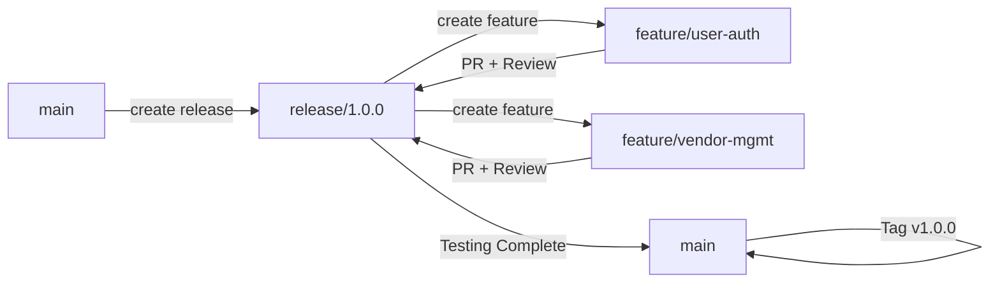

# Git Workflow and Branching Strategy

This document outlines the Git workflow and branching strategy for the Event Booking Platform project. All team members must follow these guidelines to ensure smooth collaboration and code management.

## 📋 Table of Contents

- [Branch Structure](#branch-structure)
- [Workflow Overview](#workflow-overview)
- [Getting Started](#getting-started)
- [Feature Development](#feature-development)
- [Code Review Process](#code-review-process)
- [Release Process](#release-process)
- [Hotfix Process](#hotfix-process)
- [Best Practices](#best-practices)
- [Common Commands](#common-commands)

## 🌳 Branch Structure

```
main (protected)
│
├── release/1.0.0
│   │
│   ├── feature/user-authentication
│   ├── feature/vendor-management
│   ├── feature/event-management
│   ├── feature/admin-dashboard
│   ├── feature/booking-system
│   └── feature/public-discovery
│
└── hotfix/critical-bug-fix
```

### Branch Types

1. **`main`** (Protected)
   - Production-ready code only
   - No direct commits allowed
   - Only receives merges from release branches after testing
   - Tagged with version numbers for releases

2. **`release/*`**
   - Active development branch
   - Integration point for all features
   - Format: `release/X.Y.Z` (e.g., `release/1.0.0`)
   - All feature branches merge here

3. **`feature/*`**
   - Individual feature development
   - Created from the current release branch
   - Format: `feature/issue-description` (e.g., `feature/user-authentication`)
   - Deleted after merging to release

4. **`hotfix/*`**
   - Emergency fixes for production
   - Created from `main`
   - Merged to both `main` and current `release` branch

## 🔄 Workflow Overview



## 🚀 Getting Started

### 1. Clone the Repository

```bash
git clone git clone https://github.com/hanumanc/phx-event-booking
cd phx-event-booking
```

### 2. Setup Git Configuration

```bash
# Set your user information
git config user.name "Your Name"
git config user.email "your.email@company.com"

# Set up useful aliases
git config --global alias.co checkout
git config --global alias.br branch
git config --global alias.ci commit
git config --global alias.st status
```

### 3. Fetch All Branches

```bash
git fetch --all
git branch -a  # List all branches
```

## 💻 Feature Development

### Step 1: Create Feature Branch

Always create your feature branch from the current release branch:

```bash
# Ensure you have the latest release branch
git checkout release/1.0.0
git pull origin release/1.0.0

# Create your feature branch
git checkout -b feature/your-feature-name

# Example for each developer:
# Developer 1
git checkout -b feature/user-authentication

# Develo